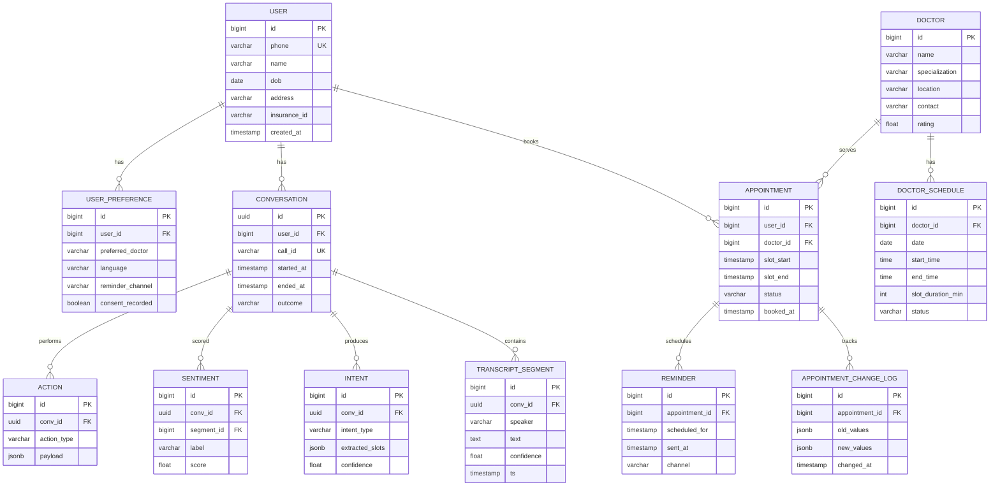
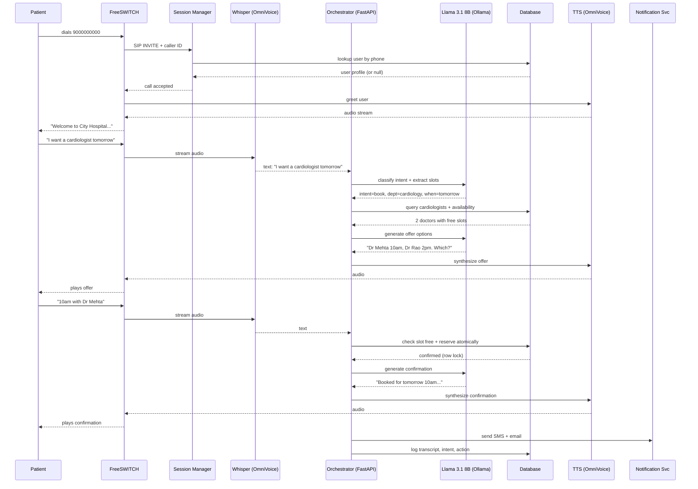
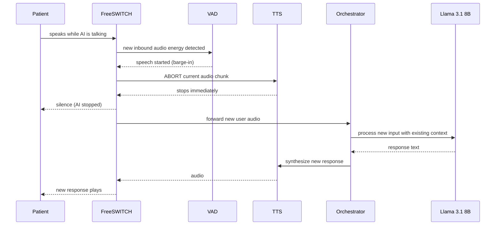
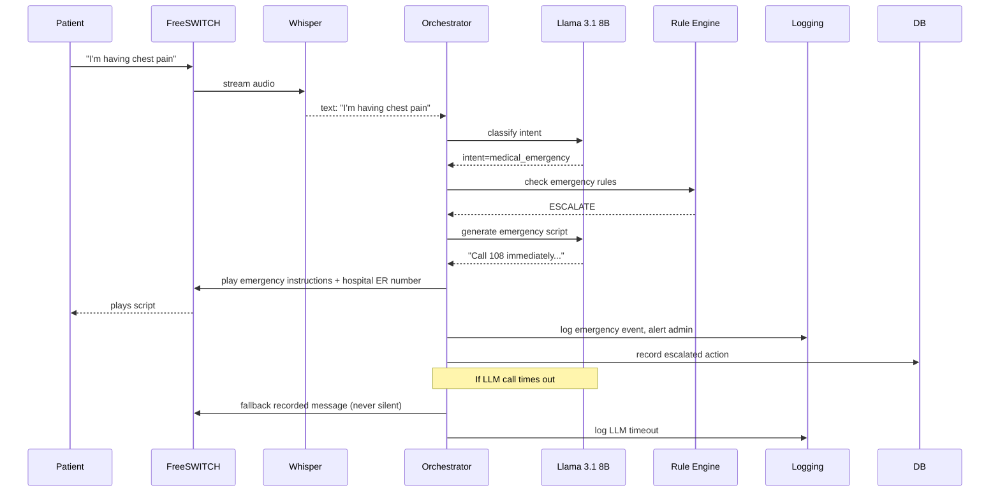
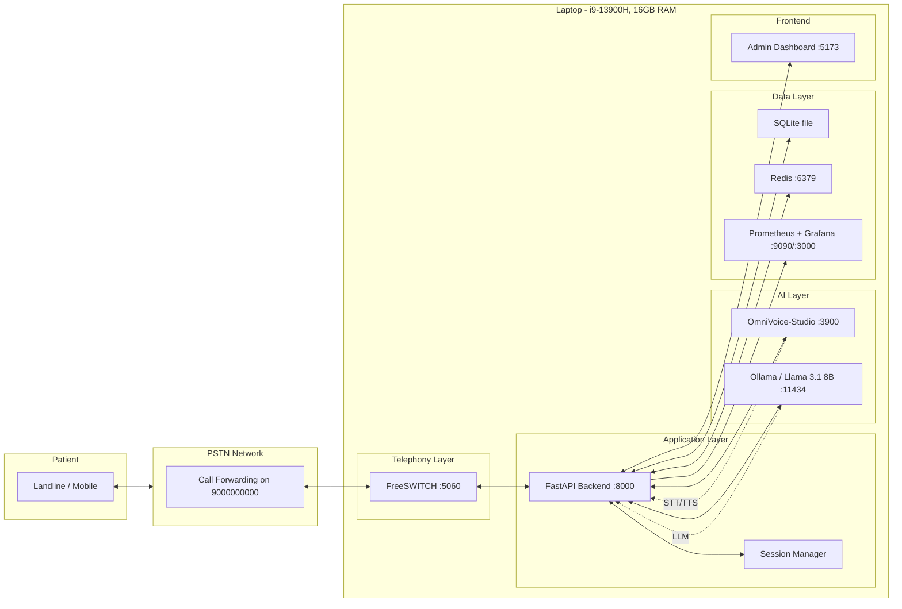
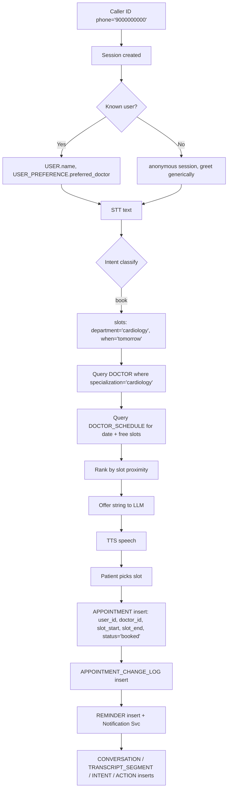
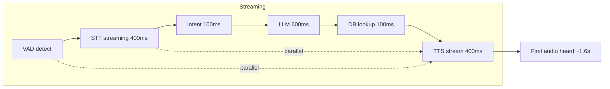

> **Status: diagrams of the planned production system.** The demo in `backend/` implements a subset of this design — see README.md.

# HospiCall — System Diagrams

> All diagrams in Mermaid — render via mermaid.live, VS Code Mermaid extension, or GitHub Markdown.

---

## 1. ER Diagram

---

## 2. Sequence Diagram — Happy Path Booking

---

## 3. Sequence Diagram — User Interrupts AI

---

## 4. Sequence Diagram — Failure / Escalation

---

## 5. Deployment Diagram — Demo (Laptop)

---

## 6. Data Flow Diagram — Booking Request (field-level)

---

## 7. Call-Latency Budget Diagram

